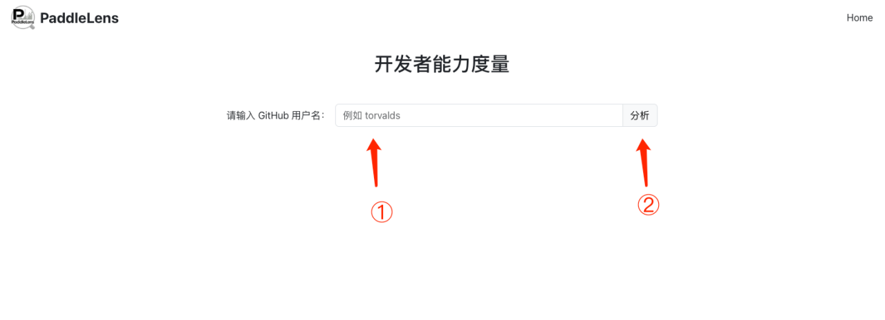
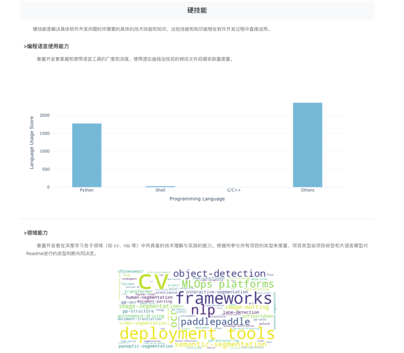
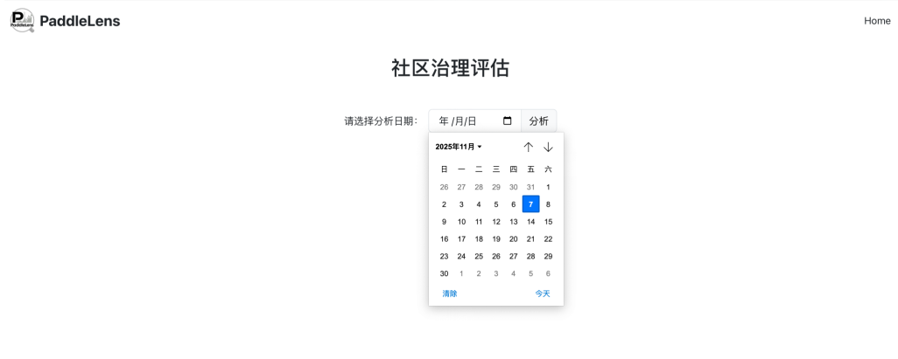
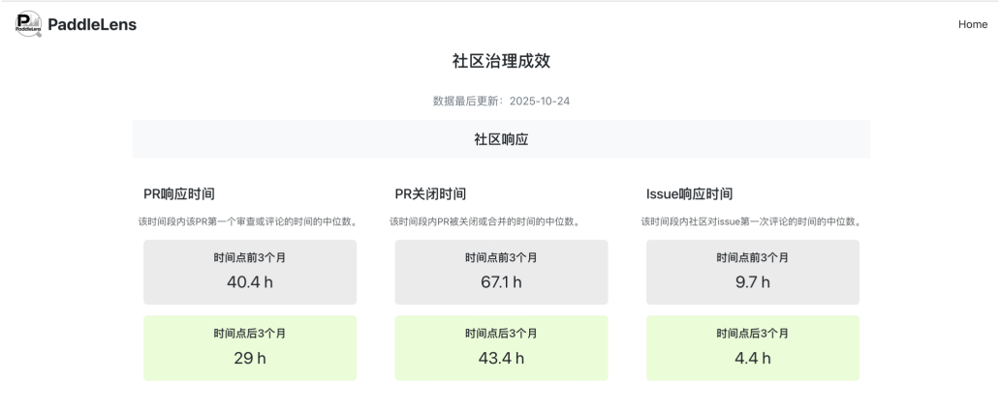
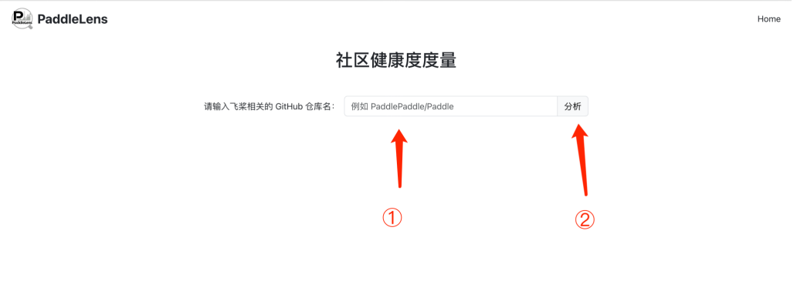
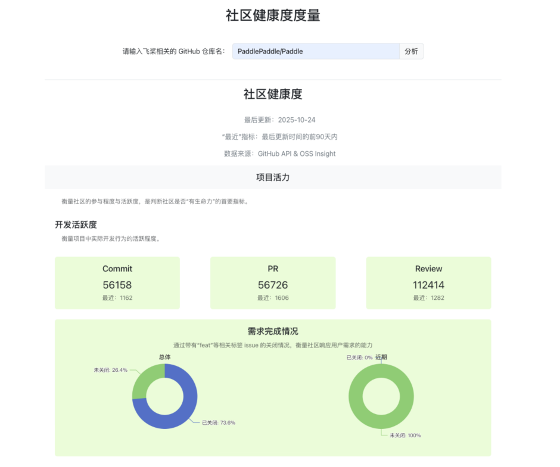

# PaddleLens

<p align="center">
  
</p>

欢迎来到PaddleLens！

这是一个为飞桨开源社区打造的社区度量平台，包括三个部分：

* 开发者能力度量：通过开发者在飞桨相关项目中的贡献数据度量其能力，包含基本信息、在飞桨中的开发经验、硬技能与软技能4个部分。
* 社区治理评估：展示飞桨开发者对飞桨社区治理规则的评分。治理规则评估包含针对项目使用、社区贡献、项目组织和维护三个维度的18项评估指标。
* 社区生态分析：通过Github开发数据，度量飞桨相关项目社区的健康度，包含活力、组织、韧性、四个维度。

此外，PaddleLens代码仓库中还包含对飞桨下游生态进行手动和自动分析的数据处理过程，有助于未来再次分析飞桨下游生态时对分析方法进行复用。

## 安装与使用方法

#### 1.环境准备

推荐操作系统：Ubuntu 24.04.1 LTS
推荐环境：anaconda (v 24.11.3), python (v 3.12.4), Node.js (v 22.17.0)

#### 2.代码和数据准备

新建两个终端，指定相同目录。

1）克隆项目
在其中一个终端中执行：
```bash
git clone https://github.com/PFCCLab/PaddleLens.git
cd PaddleLens
```

2）下载数据集
由于github上传限制，数据集存储在google drive平台。[下载数据集](https://drive.google.com/drive/folders/1nMsNwrHIOH--RsoF2L510PNcIax-7xys?usp=drive_link)，该链接内的data-20251024.zip为截至2025年10月24日的数据快照；也可下载其他日期的数据快照。
下载数据集，放入当前目录，解压（解压后为data/），放入backend目录下
```bash
unzip data-20251024.zip
mv data backend/
```

#### 3.启动后端

1）在上一步的终端中执行
```bash
cd backend/
```
2）新建conda环境并安装依赖

```bash
conda create -n paddle-lens
conda activate paddle-lens
pip install -r requirements.txt
```

3）在当前目录建立`.env`文件，复制以下内容并按需替换：
```bash
GITHUB_TOKEN=xxx # 你的github api token 
OPENAI_BASE_URL=xxx # 你的openai base url，如果使用我们提供的数据集，无需填写
OPENAI_API_KEY=xxx # 你的openai api key，如果使用我们提供的数据集，无需填写
MODEL=xxx  # 使用的大语言模型，如果使用我们提供的数据集，无需填写
```

4）启动后端服务（默认使用 Uvicorn + FastAPI）：
```bash
uvicorn main:app --host 0.0.0.0 --port 8000 2>&1 | tee log.txt
```
后端默认监听在8000窗口，可以使用PastAPI提供的API文档 http://127.0.0.1:8000/docs 访问后端api。

#### 4.启动前端

1）在另一个终端中执行
```bash
cd PaddleLens/fronted
```

2）安装依赖
```
npm install
```

3）在当前目录（frontend/）创建.env文件，复制以下内容
```
VITE_API_BASE_URL=http://localhost:8000
```

4）启动前端服务：
```bash
npm run dev
```

前端默认监听在5173窗口。

#### 5.使用

根据前端log在浏览器打开前端url，来到主页。

1）在主页点击“开发者能力度量”，进入度量界面。在输入框中输入用户的github username(注意不是可自定义的Name)，点击“分析”，得到能力度量结果。

<p align="center">
  
</p>

下图展示了某一开发者的硬技能度量结果。

<p align="center">
  
</p>

2）在主页点击“社区治理评估”，进入度量界面。在输入框中选择日期，点击“分析”，得到当前已有的治理规则条目，以及当前日期前后三个月的治理成效度量结果。

<p align="center">
  
</p>

下图展示了某日期前后的治理情况。

<p align="center">
  
</p>

3）在主页点击“社区生态分析”，进入度量界面。在输入框中输入飞桨项目名称（如“PaddlePaddle/Paddle”），点击“分析”，得到健康度度量结果。健康度度量仅支持PaddlePaddle和PFCCLab两个组织下的项目。

<p align="center">
  
</p>

下图展示了Paddle主仓库的社区健康度情况。

<p align="center">
  
</p>


## 贡献

有任何问题、想法，欢迎打开issue。